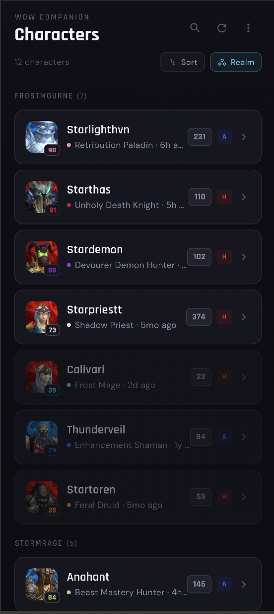
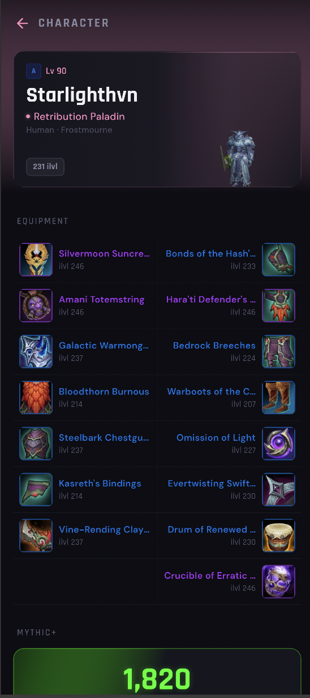

# WoW Companion

A mobile World of Warcraft companion app built with Flutter. View your characters, gear, Mythic+ scores, and raid progression — all pulled from the official Battle.net API.

<p align="center">
  
  &nbsp;&nbsp;&nbsp;
  
</p>

## Features

- **Battle.net OAuth** — Sign in with your Battle.net account
- **Character List** — All your characters with search, sort, and group by realm/class/race/faction
- **Character Dashboard** — Hero card with character render, class-colored theme
- **Equipment Grid** — Two-column mirrored layout with item icons, quality colors, enchants, and gems
- **Mythic+ Scores** — Rating badge, best runs per dungeon, affix toggle (Best/Tyrannical/Fortified)
- **Raid Progression** — Current expansion raids with per-difficulty progress, tap into boss details with portraits
- **Performance** — Cache-first strategy, parallel API calls, progressive loading with shimmer placeholders
- **Cross-platform** — Runs on Android and Web

## Getting Started

### Prerequisites

- Flutter 3.2+
- A [Battle.net Developer](https://develop.battle.net/) application (Client ID + Secret)

### Setup

1. Clone the repo:
   ```bash
   git clone https://github.com/faizal97/mobile-wow-companion.git
   cd mobile-wow-companion
   ```

2. Create a `.env` file:
   ```
   BNET_CLIENT_ID=your_client_id
   BNET_REDIRECT_URI=http://localhost:8080/auth/callback
   AUTH_PROXY_URL=https://your-auth-proxy.workers.dev
   ```

3. Run locally (web):
   ```bash
   ./run_dev.sh
   ```

4. Build Android APK:
   ```bash
   flutter build apk --release \
     --dart-define=BNET_CLIENT_ID=your_client_id \
     --dart-define=AUTH_PROXY_URL=https://your-auth-proxy.workers.dev
   ```

### Auth Proxy

The app uses a Cloudflare Worker to handle OAuth token exchange, keeping your client secret server-side. See [`worker/`](worker/) for the source.

To deploy your own:
```bash
cd worker
npm install
npx wrangler secret put BNET_CLIENT_ID
npx wrangler secret put BNET_CLIENT_SECRET
npx wrangler deploy
```

## Architecture

```
lib/
  config.dart              # Environment-based configuration
  main.dart                # App entry, providers, OAuth handling
  models/                  # Data models (Character, Equipment, M+, Raids)
  screens/                 # Login, Character List, Dashboard, Raid Detail
  services/                # API service, Auth, Cache, Providers
  theme/                   # Dark theme, WoW class colors, item quality colors
  widgets/                 # Hero card, Equipment grid, M+ section, Raid tiles
worker/
  src/index.js             # Cloudflare Worker auth proxy
```

**Key patterns:**
- **Provider** for state management
- **Cache-first** with 15-minute TTL via SharedPreferences
- **Parallel API fetching** with `Future.wait`
- **Progressive icon enrichment** — data loads first, icons pop in after
- **Class-colored theming** — AnimatedTheme transitions per character

## Tech Stack

- **Flutter/Dart** — Cross-platform UI
- **Battle.net API** — Character data, equipment, M+, raid encounters
- **Cloudflare Workers** — OAuth token exchange proxy
- **SharedPreferences** — Cross-platform caching
- **CachedNetworkImage** — Image caching with placeholders

## License

This project is not affiliated with or endorsed by Blizzard Entertainment. World of Warcraft and Battle.net are trademarks of Blizzard Entertainment, Inc.
